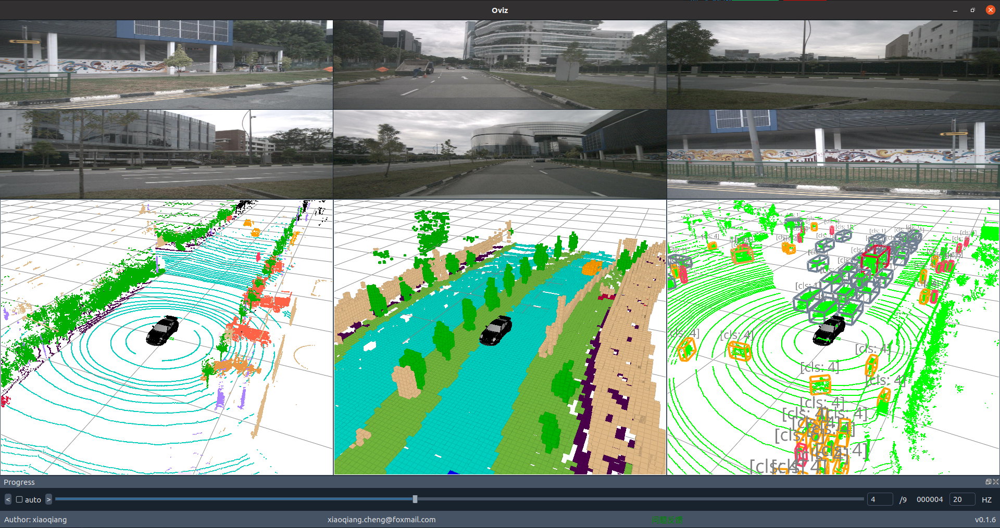

<div align="center">
  
  <div>&nbsp;</div>
  <div align="center">
    <b><font size="6">Xiaoqiang Studio</font></b>
    <sup>
      <a href="https://github.com/xiaoqiang-cheng">
        <i><font size="4">SUB1</font></i>
      </a>
    </sup>
    &nbsp;&nbsp;&nbsp;&nbsp;
    <b><font size="6">Oviz</font></b>
    <sup>
      <a href="https://github.com/xiaoqiang-cheng/Oviz">
        <i><font size="4">TRY IT OUT</font></i>
      </a>
    </sup>
  </div>
  <div>&nbsp;</div>
</div>

<div align="center">

English | [简体中文](README_zh.md) 

</div>



---
## 介绍

一个正经的可视化工具，Xiaoqiang Studio三件套之一，Do Nothing, Show Anything。


## 快速开始

### 安装&启动

oviz 支持在 Linux，Windows 和 macOS 上运行。它需要python3.7~python3.9 (含) 的 python环境，建议使用conda 来管理该环境，以下操作默认在符合上述要求的python环境下执行。您可以使用pypi 源安装或源码安装两种方式。

(1) 安装

- pypi安装

```shell
pip install oviz
```

- 源码安装

```shell
git clone https://github.com/xiaoqiang-cheng/Oviz.git
cd Oviz/
pip install -v -e .
```

(2) 启动

```shell
oviz
```

如果一切顺利，你将会看到如下启动界面，由于作者是中国人，在开发中国大部分界面信息使用了中文，将尽快适配全英文版本。


### 显示3D元素

- 基本使用

- 显示点云
- 显示OCC
- 显示bbox

### 显示2D元素

- 显示图像

### 显示车体


### 重置

你可以通过以下操作来重置工具

1. 首先，保证 oviz 处于关闭状态
2. 使用以下方式来删除用户配置

```shell
rm -r ~/.oviz
```


## 进阶使用

### 增加窗体

### 维度介绍

### 历史记录

### 自动录屏

### 快捷键

| 功能           | 快捷键         |
| -------------- | -------------- |
| 显示图片       | `Ctrl+Shift+I` |
| 显示3D窗口     | `Ctrl+Shift+C` |
| 显示日志       | `Ctrl+Shift+L` |
| 显示进度条     | `Ctrl+Shift+P` |
| 显示元素控制台 | `Ctrl+Shift+E` |
| 显示全局控制台 | `Ctrl+Shift+G` |
| 显示图片标题栏 | `Ctrl+Shift+T` |
| 显示状态栏     | `Ctrl+Shift+S` |
| 显示菜单栏     | `Ctrl+Shift+B` |
| 保存       | `Ctrl+S`   |
| 自动播放   | `Ctrl+P`   |
| 上一帧     | `Ctrl+L`   |
| 下一帧     | `Ctrl+N`   |

## 扩展功能

### Magic Pipeline

### Oviz API


## 更新计划


## Starchart

[](https://star-history.com/#xiaoqiang-cheng/Oviz&Date)

## Contributors

<a href="https://github.com/xiaoqiang-cheng/Oviz/graphs/contributors">
  
</a>