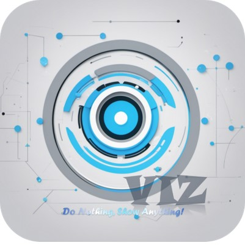
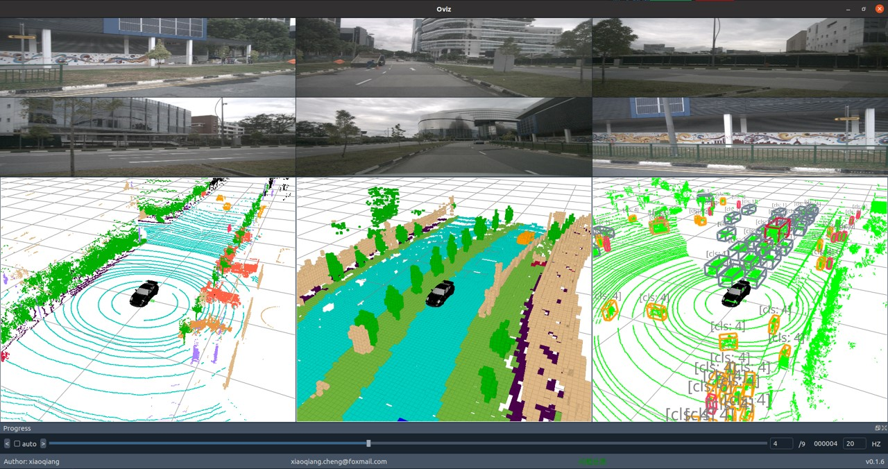
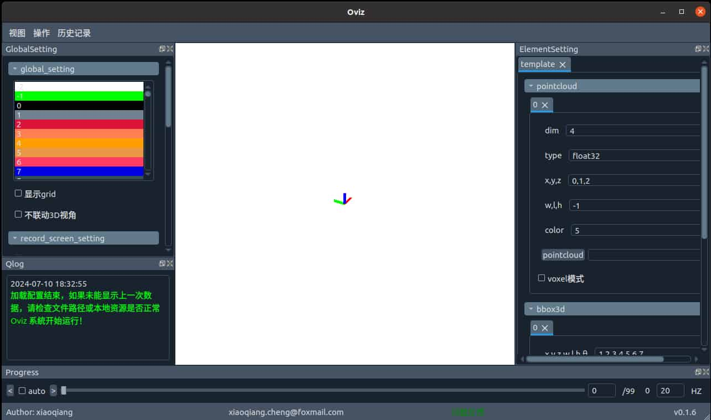
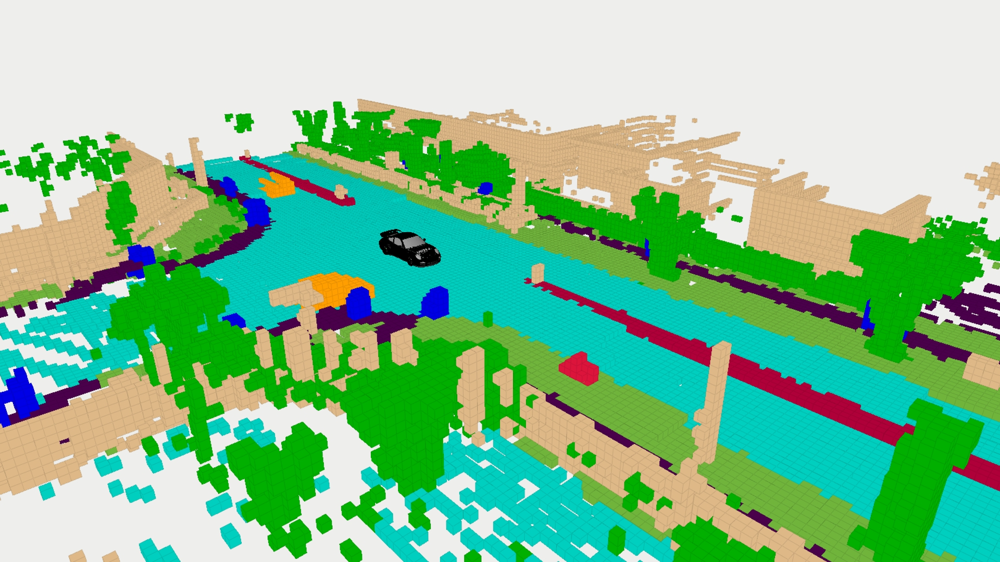
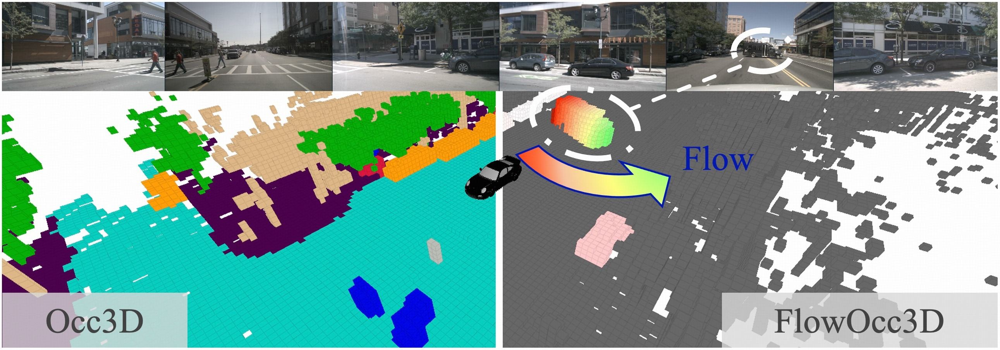
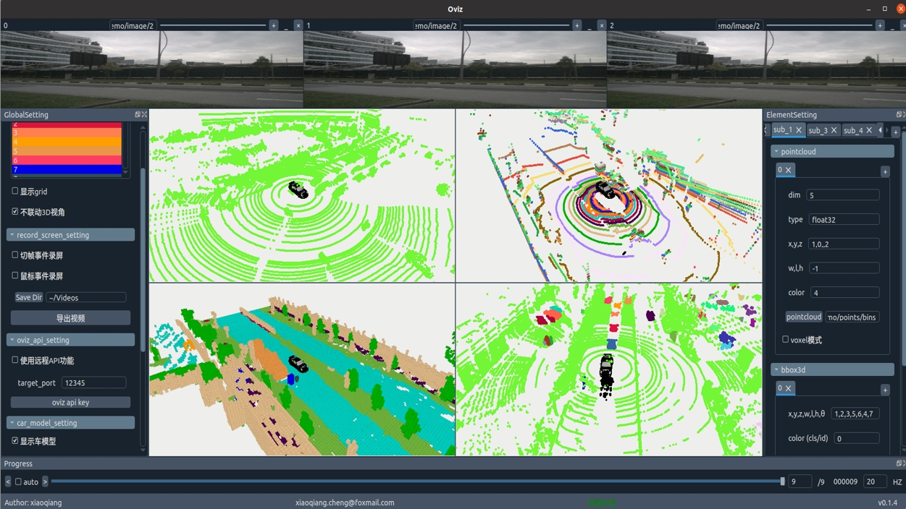
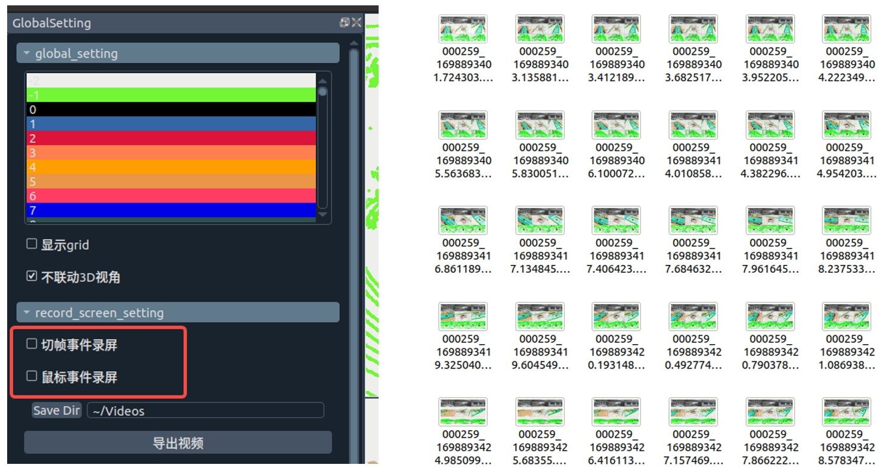
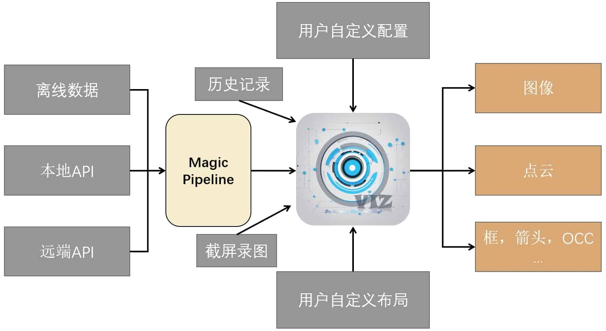

<div align="center">
  
  <div>&nbsp;</div>
  <div align="center">
    <b><font size="6">Xiaoqiang Studio</font></b>
    <sup>
      <a href="https://github.com/xiaoqiang-cheng">
        <i><font size="4">SUB1</font></i>
      </a>
    </sup>
    &nbsp;&nbsp;&nbsp;&nbsp;
    <b><font size="6">Oviz</font></b>
    <sup>
      <a href="https://github.com/xiaoqiang-cheng/Oviz">
        <i><font size="4">TRY IT OUT</font></i>
      </a>
    </sup>
  </div>
  <div>&nbsp;</div>
</div>

<div align="center">

English | [简体中文](README.md)

</div>



---
## Introduction

A serious visualization tool, part of the Xiaoqiang Studio trilogy, Do Nothing, Show Anything.

A lightweight Python visualization tool designed specifically for computer vision tasks, Oviz simplifies complex visualization operations, allowing you to focus on the data itself and break free from cumbersome visualization setups. Whether it's displaying 3D point clouds, rendering 2D images, or showcasing intricate vehicle models, Oviz handles it all effortlessly.

### Features

- **Cross-platform Compatibility**: Supports Linux, Windows, and macOS platforms.
- **Easy Installation**: Available via PyPI and source code installation methods.
- **Quick Start**: Get started with just one command.
- **Multi-tasking Support**: Handles 3D elements like point clouds, OCC, bbox, and 2D image visualizations.
- **User-Friendly**: Shortcut keys, automatic recording, and comprehensive history functionality.
- **Extensible**: Offers Oviz API and Magic Pipeline for rapid expansion.

## Getting Started

### Installation & Launch

oviz runs on Linux, Windows, and macOS. It requires Python 3.7 or higher. We recommend using conda to manage your Python environment. Perform the following steps in a compatible Python environment.

(1) Installation

- PyPI Installation

```shell
pip install oviz
```
- Source Installation

```shell
git clone https://github.com/xiaoqiang-cheng/Oviz.git
cd Oviz/
pip install -v -e .
```

(2) Launch

```shell
oviz
```

If everything goes smoothly, you'll see the startup interface below. Due to the developer being Chinese, most interface messages during development are in Chinese and will soon adapt to an all-English version.



### Interface Introduction

- GlobalSetting
  - Global settings window for adjusting element colors, setting recording, displaying vehicle models, and other common configurations.

- ElementSetting
  - Element settings window for selecting offline data such as point clouds, bbox, etc.

- Progress
  - Used for switching frames.

- Image
  - Image display window for showing images.

These are the main components of oviz, which can be freely shown or hidden through the menu bar->view or shortcut operations.


### Displaying 3D Elements

- Displaying Point Clouds
  - Supported point cloud file formats include: .bin / .pcd / .txt
    - bin format is a binary point cloud format, please ensure it can be parsed into N * X dimensions array through np.fromfile api, and in
    - pcd format comes with parsing field, so no dimension needs to be specified
    - txt point cloud, please ensure that the dimensions in txt are separated by spaces or commas, one point per line
  - First, click ElementSetting->template->pointcloud->[pointcloud] button, select the point cloud folder to display
  - According to the true filling of dim, xyz dimension, wlh dimension (optional, -1 is not set), color dimension (color display will be displayed according to the color table set in GlobalSetting)
  - The point cloud will be displayed in the central 3D display area.
- Displaying OCC
  - OCC display settings are completely consistent with point clouds, please operate according to the file and configuration supported by point clouds
  - OCC's wlh can be actively set, such as no configuration, will use the default OCC grid size (0.4m)
  - Visual effect as follows:

  

- Displaying bbox3d
  - Currently only txt format bbox3d result file is supported for visualization
  - First, click ElementSetting->template->bbox3d->[bbox3d] button, select the bbox folder to display
  - Fill in the relevant dimensions (xyzwlhθ)
  - Fill in the rotation direction and phase difference.
    - This column needs to fill in two numbers, the first is the clockwise/counterclockwise direction, the second is the phase difference. The default direction is defined as starting from the x-axis, counterclockwise rotation (1.0, 0 at this time)
    - For example, in the current coordinate system, the bbox3d direction is defined as starting from the y-axis, clockwise, the direction is clockwise, and the phase difference is 0.5pi, the current column is filled with [-1, 0.5]

### Displaying 2D Elements

- Displaying Images
  - If the image window is hidden, you should first display the image window, that is: menu bar->view->show image or display image window via shortcut (Ctrl+Shift+I)
  - Double-click the image window to select the offline image folder to display the image
  - You can adjust the image display order and position by dragging the image title bar
  - If the widths of multiple image windows adjusted after are not consistent, press [r] to align automatically

### Displaying Vehicles

- By selecting [GlobalSetting->car_model_setting->display car model], you can display a simulated car at the center of the 3D view
- If the current vehicle heading direction is inconsistent with the data coordinate system direction, please adjust the vehicle heading direction by reselecting each time the vehicle heading direction is adjusted 0.5pi

### Reset

When encountering unexpected bugs that cause oviz to be unable to operate normally, you can reset the tool through the following steps

1. First, make sure that oviz is closed
2. Use the following method to delete user configuration

```shell
rm -r ~/.oviz
```

## Advanced Usage

### Adding Windows

Whether it's 3D components or 2D components, oviz supports adding multiple sets of data. Simply ensure all offline data files have consistent filenames for easy comparative visualization. For example, the occ flow visualization in ECCV2024 [ViewFormer](https://github.com/ViewFormerOcc/ViewFormer-Occ) is rendered based on this feature.



- Image Windows
  - Each image window includes buttons + and x in the top right corner for easy addition and deletion of the current image window.
- 3D Views
  - In the ElementSetting window, clicking the + next to "template" allows you to effortlessly add a parallel set of 3D views. By selecting the same data operation, you can achieve visual comparisons.
  - For visualization elements within the same group (e.g., point clouds, bounding boxes), you can directly add them. For instance, clicking + on the right side of point cloud adds a new set of point clouds within the current 3D view. Note that in this mode, color is determined by stacking order rather than by color dimensions.

A complete multi-window example is shown below:



### History Records

Once you've configured local offline data, if you want to save the current configuration and data paths for future restoration after modifications, use the shortcut (Ctrl+S) to save. To restore, click on Menu -> History Records.


### Automatic Screen Recording

We offer two types of recording events (frame switching and mouse events). Frame switching saves the current window rendering when you switch to the next frame, while mouse events record window rendering when you perform mouse operations (e.g., rotating 3D view). Simply select the corresponding event under GlobalSetting -> record_screen_setting, then play the data. Click Export Video to export all recorded images as an mp4 video.

Each saved frame and video is stored in the directory configured under [Save Dir].



### Shortcuts

| Function             | Shortcut       |
| -------------------- | -------------- |
| Show Images          | `Ctrl+Shift+I` |
| Show 3D Windows      | `Ctrl+Shift+C` |
| Show Log             | `Ctrl+Shift+L` |
| Show Progress Bar    | `Ctrl+Shift+P` |
| Show Element Console | `Ctrl+Shift+E` |
| Show Global Console  | `Ctrl+Shift+G` |
| Show Image Title Bar | `Ctrl+Shift+T` |
| Show Status Bar      | `Ctrl+Shift+S` |
| Show Menu Bar        | `Ctrl+Shift+B` |
| Save                 | `Ctrl+S`       |
| Auto Play            | `Ctrl+P`       |
| Previous Frame       | `Ctrl+L`       |
| Next Frame           | `Ctrl+N`       |

## Extended Features

We provide two convenient ways to extend functionality. The architecture of oviz is illustrated in the following diagram:



### Magic Pipeline

Python's capabilities allow us to perform operations like magic, hence the term Magic Pipeline. Specifically, it serves as a window between serialized data and the rendering interface. By implementing a pipeline, we can modify or print information in real-time to aid in debugging.

Enable it via GlobalSetting -> magic_pipeline_setting. Clicking [Open Editor] opens an example pipeline code in vscode (you must have it installed). You can adapt this function to control whether the data executes the current process.

I attempted to simplify pipeline function design with a decorator, but explaining it remains complex. So, if you intend to use it, experiment or read the code. Feel free to contact me for remote discussions on this feature.

Here's an example pipeline implementation:

```python
'''
note:
    1, if you need to add a new pipeline to repo, please add switch for it
    2, do not push you temporary pipe to repo
    3, add params instructions for your pipeline to easily apply
    4, all pipeline will be executed in sequence, so switch is very very important
    5, do not remember return data_dict
'''

import os
import numpy as np
from Oviz.MagicPipe.core import magic_pipeline_iterate

def magic_debug(self, key, data_dict, **kargs):
    '''
        print kargs when use magic pipeline
        {
            "magic_debug" : 1
        }
    '''
    if ("magic_debug" in kargs.keys()) and (kargs['magic_debug'] == 1):
        print(kargs)
    return data_dict


@magic_pipeline_iterate(element_keys=['bbox3d'], switch_key="fix_nus_bbox3d")
def fix_nus_bbox3d(self, key, group, ele, index, data, **kwargs):
    data = data.astype(np.float32)
    if len(data.shape) == 1:
        data = data.reshape(-1, data.shape[0])
    score_mask = data[:, -1] > 0.3
    data = data[score_mask]

    data[:, 3] = data[:, 3] + data[:, 6] / 2.0
    return data
```

### Oviz API

We provide an API that allows you to call Oviz visualizations in your code, similar to using OpenCV. This feature is currently under development and supports only a few elements. Future updates may include refactoring and optimizations, but we believe this feature holds significant promise.

Remote visualization poses a major challenge compared to local visualization. Therefore, we've implemented two middleware solutions based on TCP/IP and Share Memory for remote and local API functionality.


You can use it as follows:

- **Local API**

```python
from Oviz import Oviz
import numpy as np

for i in range(10):
    Oviz.imshow("image/0/%s.jpg"%(str(i).zfill(6)))
    Oviz.imshow("image/1/%s.jpg"%(str(i).zfill(6)))

    fake_img = np.ones((720, 720, 3), dtype=np.uint8) * i * 10

    Oviz.imshow(fake_img)
    Oviz.pcshow("points/bins/%s.bin"%(str(i).zfill(6)))
    print(i)
    Oviz.waitKey()
```

- **Remote API**

```python
from Oviz import Oviz
import numpy as np

Oviz.init_oviz_api("192.168.18.106")

for i in range(10):
    Oviz.imshow("image/0/%s.jpg"%(str(i).zfill(6)))
    Oviz.imshow("image/1/%s.jpg"%(str(i).zfill(6)))

    fake_img = np.ones((720, 720, 3), dtype=np.uint8) * i * 10

    Oviz.imshow(fake_img)
    Oviz.pcshow("points/bins/%s.bin"%(str(i).zfill(6)))
    print(i)
    Oviz.waitKey()
```

Through our abstraction, the remote API requires initialization with an IP address and port in a local network, but otherwise functions identically to the local API. To use the remote API, enable this feature in oviz under GlobalSetting -> oviz_api_setting.

## Future Plans

-  Display 2D Bounding Boxes
-  Display 2D Segmentation
-  Display Lane Lines
-  Implement 3D to 2D Projection
-  Improve Operational Portability
-  etc...

If you encounter issues or have requests, [feel free to raise an issue](https://github.com/xiaoqiang-cheng/Oviz/issues) for prompt resolution. You can also reach out directly via email at xiaoqiang.cheng@foxmail.com.

Moreover, contributions and feature additions are welcome. Let's collaborate to enhance the functionality together.

## Starchart

[](https://star-history.com/#xiaoqiang-cheng/Oviz&Date)

## Contributors

<a href="https://github.com/xiaoqiang-cheng/Oviz/graphs/contributors">    </a>
